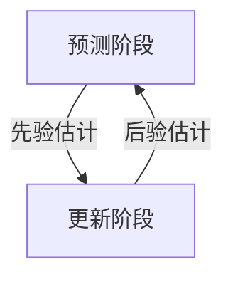

# 通过卡尔曼滤波优化的AlvaAR项目

本项目试图在开源项目 [AlvaAR](https://github.com/alanross/AlvaAR) 的基础上进行修改，实现相对可靠的AR导航功能。  
本项目的核心部分是在前端为获取到的IMU数据增加一个基于时序记忆预测的卡尔曼滤波算法，从而缓解在相机运动过程中由于位姿突变导致的AR组件丢失的情况，从而提高AR导航的稳定性，优化项目性能。  

## 卡尔曼滤波详细原理与数学推导

本部分将深入解析本模块中卡尔曼滤波器的核心原理，结合代码实现进行数学推导说明。

### 一、卡尔曼滤波核心思想

卡尔曼滤波器通过递归算法实现最优估计，其核心流程分为两个阶段：  



### 二、系统模型

#### 1. 状态空间模型

本系统采用10维状态向量：
$$
\mathbf{x} = \begin{bmatrix}
q_w & q_x & q_y & q_z & \omega_x & \omega_y & \omega_z & a_x & a_y & a_z
\end{bmatrix}^T
$$
状态方程：
$$
\mathbf{x}_{k} = \mathbf{F}_k\mathbf{x}_{k-1} + \mathbf{w}_k
$$
观测方程：
$$
\mathbf{z}_k = \mathbf{H}_k\mathbf{x}_k + \mathbf{v}_k
$$

#### 2. 代码对应实现

```js
// 状态初始化
this.state = new Array(10).fill(0);
this.state[3] = 1; // 四元数w分量初始化

// 状态转移矩阵（当前简化为单位矩阵）
getStateTransitionMatrix(dt) {
  const F = Array.from({ length: 10 }, () => new Array(10).fill(0));
  for (let i = 0; i < 10; i++) F[i][i] = 1;
  return F;
}
```

### 三、预测阶段（Predict）

#### 1. 状态预测

$$
\hat{\mathbf{x}}^-_k = \mathbf{F}_k\hat{\mathbf{x}}_{k-1}
$$
对应代码实现：

```js
this.state = this.multiplyMatrices(F, this.state.map(val => [val])).map(row => row[0]);
```

#### 2. 协方差预测

$$
\mathbf{P}^-_k = \mathbf{F}_k\mathbf{P}_{k-1}\mathbf{F}_k^T + \mathbf{Q}_k
$$
对应代码实现：

```js
const FP = this.multiplyMatrices(F, this.covariance);
const FPF_T = this.multiplyMatrices(FP, this.transposeMatrix(F));
this.covariance = this.addMatrices(FPF_T, this.processNoise);
```

#### 3. 过程噪声矩阵

$$
\mathbf{Q} = \begin{bmatrix}
q_{quat} & 0 & 0 \\
0 & q_{gyro} & 0 \\
0 & 0 & q_{accel}
\end{bmatrix}, \quad q = 0.01 \cdot \Delta t
$$
对应代码实现：

```js
getProcessNoiseMatrix(dt) {
  const q = 0.01 * dt;
  return Array.from({ length: 10 }, (_, i) => 
    new Array(10).fill(0).map((_, j) => (i === j ? q : 0)));
}
```

### 四、更新阶段（Update）

#### 1. 卡尔曼增益计算

$$
\mathbf{K}_k = \mathbf{P}^-_k\mathbf{H}^T(\mathbf{H}\mathbf{P}^-_k\mathbf{H}^T + \mathbf{R})^{-1}
$$
对应代码实现：

```js
const H = this.observationMatrix;
const HP = this.multiplyMatrices(H, this.covariance);
const HPH_T = this.multiplyMatrices(HP, this.transposeMatrix(H));
const S = this.addMatrices(HPH_T, this.observationNoise);
const K = this.multiplyMatrices(
  this.multiplyMatrices(this.covariance, this.transposeMatrix(H)),
  this.invertMatrix(S)
);
```

#### 2. 状态更新

$$
\hat{\mathbf{x}}_k = \hat{\mathbf{x}}^-_k + \mathbf{K}_k(\mathbf{z}_k - \mathbf{H}\hat{\mathbf{x}}^-_k)
$$
对应代码实现：

```js
const innovation = measurement.map((val, i) => val - this.state[i]);
const K_innovation = this.multiplyMatrices(K, innovation.map(val => [val]));
this.state = this.state.map((val, i) => val + K_innovation[i][0]);
```

#### 3. 协方差更新

$$
\mathbf{P}_k = (\mathbf{I} - \mathbf{K}_k\mathbf{H})\mathbf{P}^-_k
$$
对应代码实现：

```js
const KH = this.multiplyMatrices(K, H);
const I_KH = this.covariance.map((row, i) => 
  row.map((val, j) => i === j ? 1 - KH[i][j] : -KH[i][j]));
this.covariance = this.multiplyMatrices(I_KH, this.covariance);
```

### 五、关键公式推导

#### 1. 四元数积分推导

采用一阶龙格-库塔法进行四元数更新：
$$
\mathbf{q}_{k+1} = \mathbf{q}_k + \frac{\Delta t}{2}\mathbf{\Omega}(\omega)\mathbf{q}_k
$$
其中：
$$
\mathbf{\Omega}(\omega) = \begin{bmatrix}
0 & -\omega_x & -\omega_y & -\omega_z \\
\omega_x & 0 & \omega_z & -\omega_y \\
\omega_y & -\omega_z & 0 & \omega_x \\
\omega_z & \omega_y & -\omega_x & 0
\end{bmatrix}
$$
对应代码实现：

```js
integrateQuaternion(q, omega, dt) {
  const wx = omega[0] * dt / 2;
  const wy = omega[1] * dt / 2;
  const wz = omega[2] * dt / 2;

  return [
    q[0] + wx*q[3] + wy*q[2] - wz*q[1],  // q_w
    q[1] - wx*q[2] + wy*q[3] + wz*q[0],  // q_x
    q[2] + wx*q[1] - wy*q[0] + wz*q[3],  // q_y
    q[3] - wx*q[0] - wy*q[1] - wz*q[2]   // q_z
  ];
}
```

#### 2. 运动学方程

位置和速度更新采用经典运动学方程：
$$
\mathbf{v}_k = \mathbf{v}_{k-1} + \mathbf{a}_{k-1}\Delta t
$$
$$
\mathbf{p}_k = \mathbf{p}_{k-1} + \mathbf{v}_{k-1}\Delta t + \frac{1}{2}\mathbf{a}_{k-1}(\Delta t)^2
$$
对应代码实现：

```js
const newVelocity = prevState.velocity.map((v, i) => 
  v + prevState.acceleration[i] * dt);
const newPosition = prevState.position.map((p, i) => 
  p + prevState.velocity[i] * dt + 0.5 * prevState.acceleration[i] * dt * dt);
```

## 实验结果

卡尔曼滤波算法在传感器数据融合中表现出 **卓越的噪声抑制能力** 和 **稳定性提升**，具体体现在以下方面：

### 1. 加速度数据优化

| **指标** | **IMU原始数据** | **KF滤波后数据** | **优化效果** |  
| ----- | ----- | ----- | ----- |
| **方差降低率** | - | - | X: 97.2%, Y:86.0%, Z:99.1% |
| **标准差范围** | 2.27~3.17 | 0.25~0.85 | 最大降低 96%（Z轴） |
| **极值范围** | ±13.4 m/s² | ±2.77 m/s² | 异常波动减少 79% |

* 图表特征：滤波后加速度曲线显著平滑，原始数据的剧烈震荡被有效抑制（如Z轴极端值从-12.5→-0.57）。
* 物理意义：提升位置/速度估计精度，降低运动轨迹漂移。

### 2. 角速度数据优化

| **指标** | **IMU原始数据** | **KF滤波后数据** | **优化效果** |  
| ----- | ----- | ----- | ----- |
| **方差降低率** | - | - | X:92.8%, Y:94.9%, Z:95.9% |
| **标准差范围** | 5.73~6.19 | 0.23~0.45 | 最大降低 96%（Z轴） |
| **极值范围** | ±10.0 m/s² | ±0.81 m/s² | 动态响应更稳定 |

### 3. 算法优势分析  

1. 噪声抑制能力  
加速度/角速度方差降低率均 >85%，Z轴优化最显著（99%）。  
标准差缩小至原始值的 1/10~1/4，证明过程噪声（Q）与观测噪声（R）参数配置合理。  
2. 动态响应平衡  
时间序列图显示滤波后数据仍能跟踪真实运动趋势（如X加速度在16:32:35的突变被保留）。  
未出现明显滞后，表明状态转移矩阵（F）能有效描述系统动力学。  
3. 鲁棒性表现  
在多轴（X/Y/Z）数据中均表现一致，验证了算法对复杂运动的适应性。  
极值抑制效果显著（如Z加速度极值范围从-12.5~7.9→-0.57~0.81），避免异常值干扰。

## 总结

该卡尔曼滤波器在 **噪声抑制** 方面取得了优异效果，为AR导航提供了高精度的传感器数据基础。下一步可针对具体应用场景（如快速旋转、线性加速）进行细粒度调参，并集成环境感知数据（视觉SLAM）以实现多模态融合。
